# LAB01 – MongoDB CRUD Operation
## Thông tin sinh viên
* Họ tên: Nguyễn Phước Thịnh
* MSSV: 23521505
* Môn học: IE213.Q21 – Kỹ thuật phát triển hệ thống Web
* Lớp: IE213.Q21.1

---
## Mục tiêu
* Làm quen với MongoDB Atlas
* Kết nối MongoDB Atlas với MongoDB Compass
* Thực hiện các thao tác CRUD bằng mongosh
* Làm việc với database và collection trong MongoDB

---
## Công cụ sử dụng
* MongoDB Atlas
* MongoDB Compass
* Mongo Shell (mongosh)
* GitHub

---

## Thực hiện
# Bài 1: Thiết lập môi trường

## 1.1 Đăng ký MongoDB Atlas và tạo Cluster

**Kết quả**
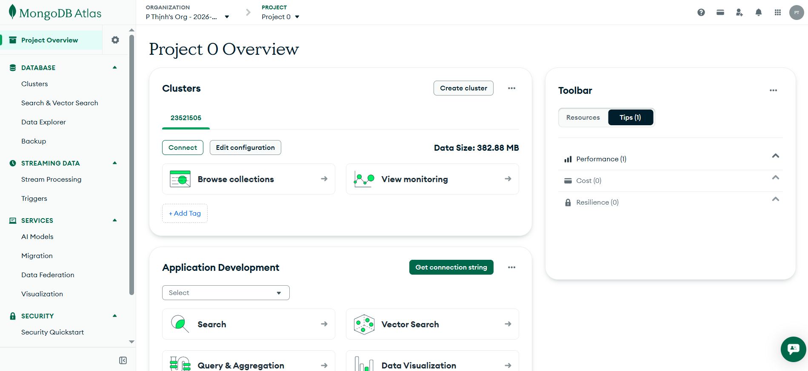


## 1.2 Tải dữ liệu mẫu vào MongoDB Atlas, Cài đặt MongoDB Compass, Kết nối MongoDB Compass với MongoDB Atlas

**Kết quả**
(../lab01/screenshots/Lab1_B1_1.2.png)

# Bài 2: MongoDB CRUD Operation

## 2.1 Tạo database có tên MSSV-IE213 trên cluster

**Kết quả**
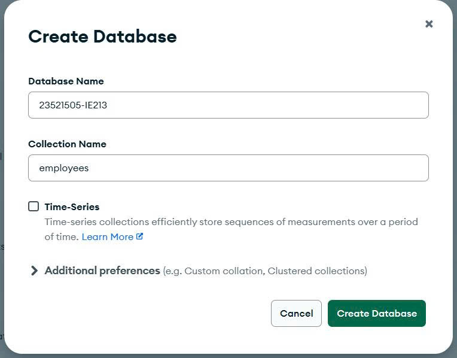


## 2.2 Thêm các document vào collection employees

**Thực hiện**
```javascript
db.employees.insertMany([
  {"id":1,"name":{"first":"John","last":"Doe"},"age":48},
  {"id":2,"name":{"first":"Jane","last":"Doe"},"age":16},
  {"id":3,"name":{"first":"Alice","last":"A"},"age":32},
  {"id":4,"name":{"first":"Bob","last":"B"},"age":64}
])
```

**Kết quả**
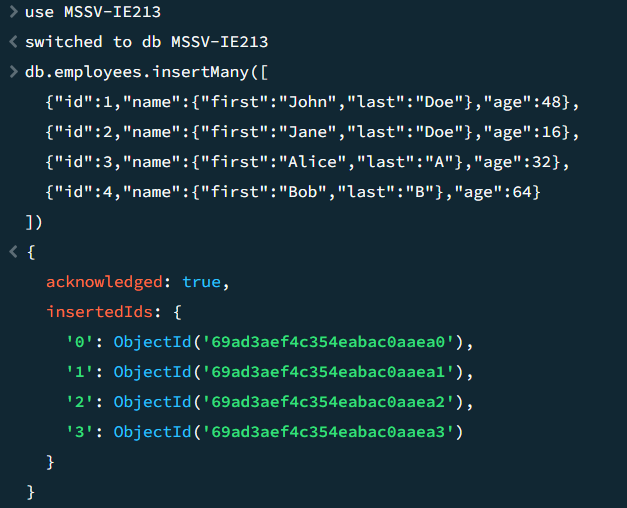


## 2.3 Tạo unique index cho trường id

**Thực hiện**
```javascript
db.employees.createIndex({ id: 1 }, { unique: true })
```

**Kết quả**
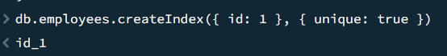


## 2.4 Tìm nhân viên John Doe

**Thực hiện**
```javascript
db.employees.find({
  "name.first": "John",
  "name.last": "Doe"
})
```

**Kết quả**
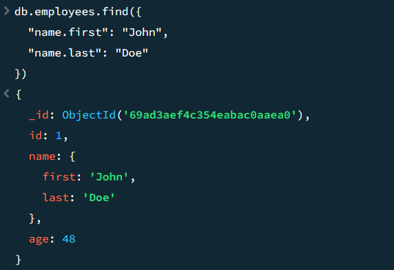


## 2.5 Tìm nhân viên có tuổi trên 30 và dưới 60

**Thực hiện**
```javascript
db.employees.find({
  $and: [
    { age: { $gt: 30 } },
    { age: { $lt: 60 } }
  ]
})
```

**Kết quả**
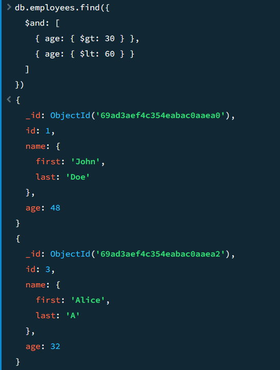


## 2.6 Thêm document có middle name

**Thực hiện**
```javascript
db.employees.insertMany([
  {"id":5,"name":{"first":"Rooney","middle":"K","last":"A"},"age":30},
  {"id":6,"name":{"first":"Ronaldo","middle":"T","last":"B"},"age":60}
])
```
Tìm document có middle name:
```javascript
db.employees.find({
  "name.middle": { $exists: true }
})
```

**Kết quả**
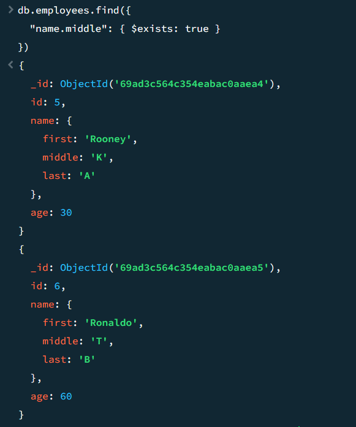


## 2.7 Xóa trường middle name

**Thực hiện**
```javascript
db.employees.updateMany(
  { "name.middle": { $exists: true } },
  { $unset: { "name.middle": "" } }
)
```

**Kết quả**
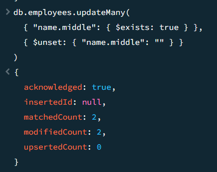


## 2.8 Thêm trường organization

**Thực hiện**
```javascript
db.employees.updateMany(
  {},
  { $set: { organization: "UIT" } }
)
```

**Kết quả**
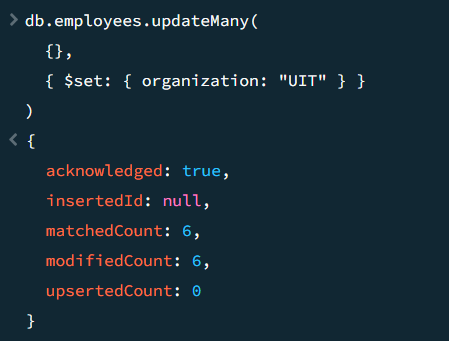


## 2.9 Cập nhật organization của id 5 và 6

**Thực hiện**
```javascript
db.employees.updateMany(
  { id: { $in: [5, 6] } },
  { $set: { organization: "USSH" } }
)
```

**Kết quả**
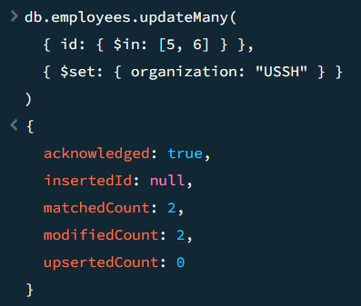


## 2.10 Tính tổng tuổi và tuổi trung bình theo organization

**Thực hiện**
```javascript
db.employees.aggregate([
  {
    $group: {
      _id: "$organization",
      totalAge: { $sum: "$age" },
      avgAge: { $avg: "$age" }
    }
  }
])
```

**Kết quả**
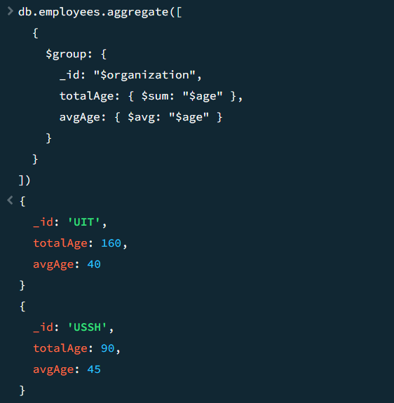

---


