# LAB02 – Thiết lập Backend với NodeJS / ExpressJS

---
## Thông tin sinh viên
* Họ tên: Nguyễn Phước Thịnh
* MSSV: 23521505
* Môn học: IE213.Q21 – Kỹ thuật phát triển hệ thống Web
* Lớp: IE213.Q21.1

---
## Mục tiêu
* Thiết lập môi trường NodeJS để phát triển backend
* Xây dựng server với ExpressJS
* Kết nối MongoDB Atlas
* Tổ chức project theo mô hình DAO – Controller – Route
* Xây dựng API /api/v1/movies để truy xuất dữ liệu movies

---
## Công cụ sử dụng
* NodeJS
* ExpressJS
* MongoDB Atlas
* MongoDB Compass
* VS Code
* AI(ChatGPT , ClaudeCode)

---
## Cấu trúc thư mục bài thực hành 2
```text
lab02
├── movie-reviews/
│   └── backend/
│       ├── api/
│       │   ├── movies.controller.js
│       │   └── movies.route.js
│       ├── dao/
│       │   └── moviesDAO.js
│       ├── node_modules/
│       ├── .env
│       ├── index.js
│       ├── package.json
│       ├── package-lock.json
│       └── server.js
├── screenshots/
└── Lab02.md
```

---
## Thực hiện
### Bài 1: Thiết lập môi trường

#### 1.1 Tải và cài đặt nodejs 

**Kết quả**

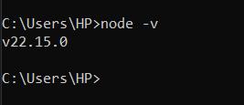


#### 1.2 Khởi tạo cây thư mục chứa mã nguồn của dự án: movie-reviews/backend

**Kết quả**

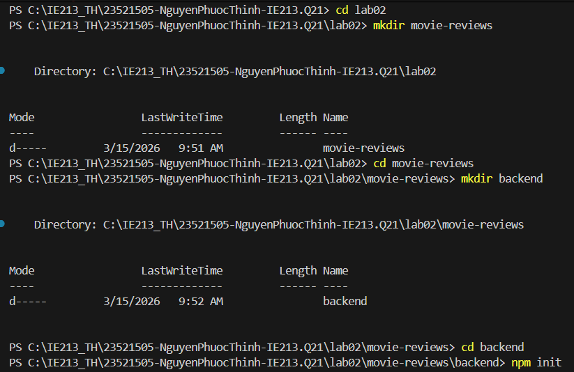


#### 1.3 Khởi tạo dự án với câu lệnh npm init & cài đặt một số dependency của dự án như mongodb, express, cors, dotenv

**Kết quả** 

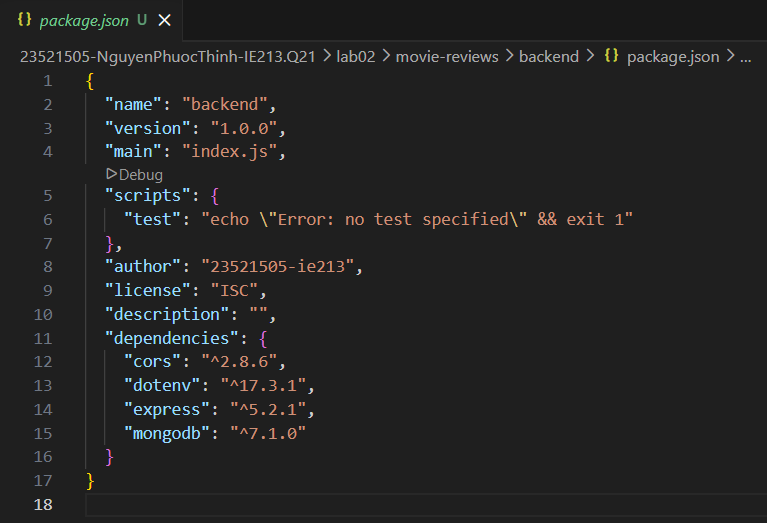


#### 1.4 Cài đặt nodemon

**Kết quả** 

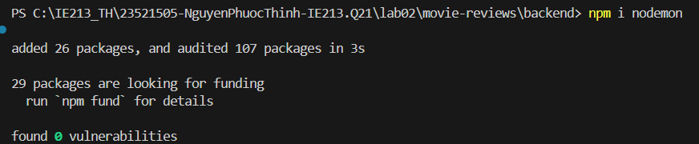


### Bài 2: Xây dựng Backend

#### 2.1 Tạo tệp tin server.js

**Kết quả**

[server.js](./movie-reviews/backend/server.js)

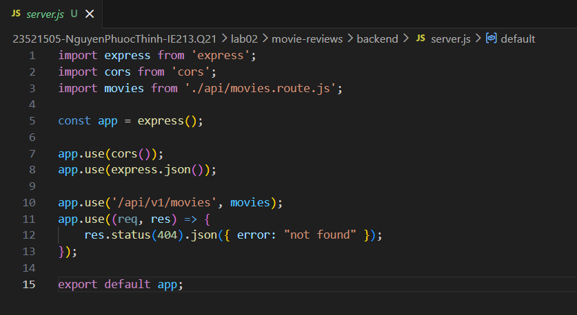


#### 2.2 Tạo tệp tin .env

**Kết quả**

[.env]

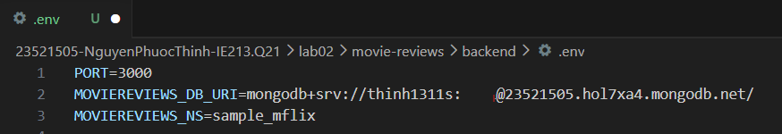


#### 2.3 Tạo tệp tin index.js

**Kết quả**

[index.js](../lab02/movie-reviews/backend/index.js)

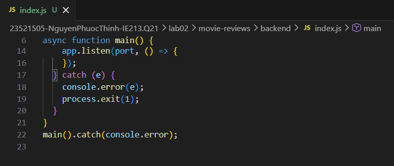


#### 2.4 Tạo tệp tin movies.route.js

**Kết quả**

[movies.route.js](../lab02/movie-reviews/backend/api/movies.route.js)

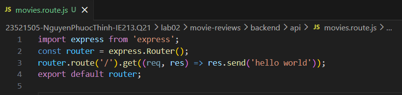


#### 2.5 Tạo tệp tin moviesDAO.js

**Kết quả**

[moviesDAO.js](../lab02/movie-reviews/backend/dao/moviesDAO.js)

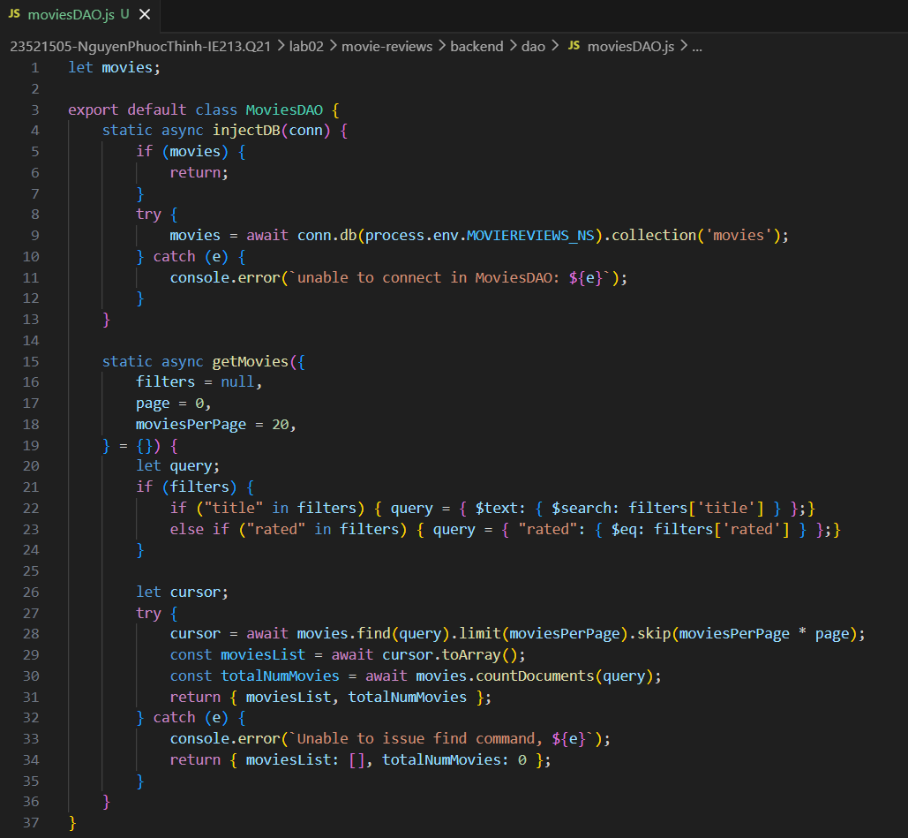


#### 2.6 Tạo tệp tin movies.controller.js

**Kết quả**

[movies.controller](../lab02/movie-reviews/backend/api/movies.controller.js)

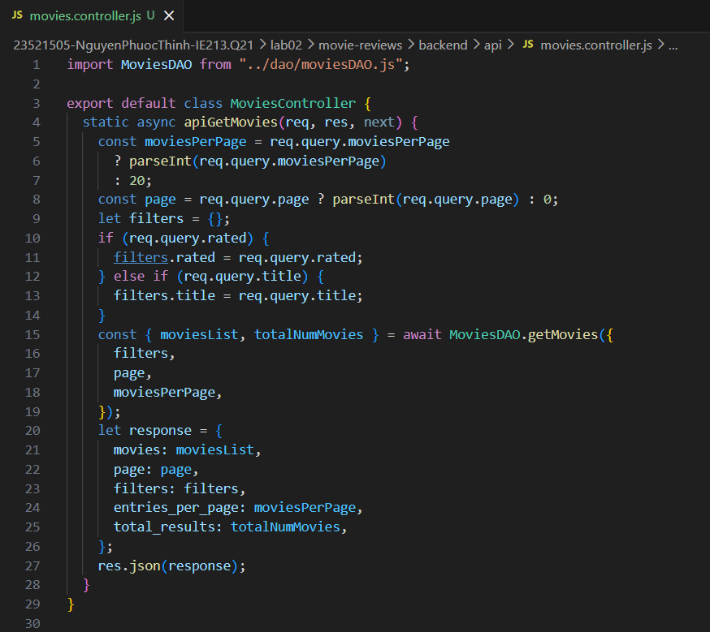


#### 2.7 Đưa Controller vừa tạo ở yêu cầu 2.6 vào định tuyến

**Thực hiện**

* Chỉnh sửa lại tiệp tin movies.route.js : Thêm apiGetMovies

    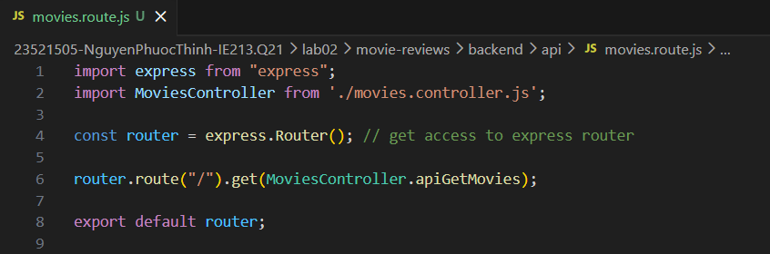

* Chạy lệnh npm start

    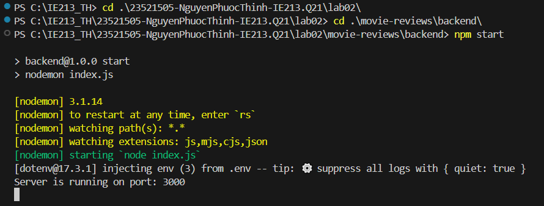

**Kết quả**

* Truy cập localhost:3000/api/v1/movies/

    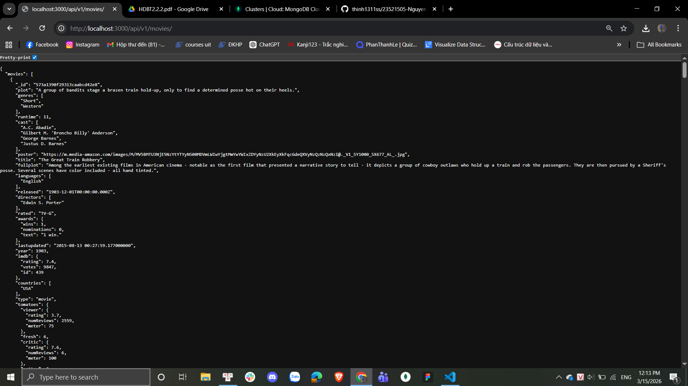

