# LAB03 – Hoàn thiện Backend cho ứng dụng minh họa

---
## Thông tin sinh viên
* Họ tên: Nguyễn Phước Thịnh
* MSSV: 23521505
* Môn học: IE213.Q21 – Kỹ thuật phát triển hệ thống Web
* Lớp: IE213.Q21.1

---
## Mục tiêu
* Xây dựng chức năng Review cho ứng dụng
* Hoàn thiện backend với mô hình DAO – Controller – Route
* Thực hiện các thao tác CRUD cho review
* Xây dựng các API nâng cao cho movies

---
## Công cụ sử dụng
* NodeJS
* ExpressJS
* MongoDB Atlas
* MongoDB Compass
* VS Code
* AI(ChatGPT , ClaudeCode)
* Insomnia

---
## Cấu trúc thư mục bài thực hành 2
```text
lab03
├── movie-reviews/
│   └── backend/
│       ├── api/
│       │   ├── movies.controller.js
│       │   ├── movies.route.js
│       │   └── reviews.controller.js
│       ├── dao/
│       │   ├── moviesDAO.js
│       │   └── reviewsDAO.js
│       ├── index.js
│       ├── server.js
│       └── package.json
├── screenshots/
└── Lab03.md
```

---
## Thực hiện
### Bài 1: Thiết lập định tuyến cho các thao tác với review (Post/Update/Delete)

**Kết quả**

[movies.route.js](./movie-reviews/backend/api/movies.route.js)

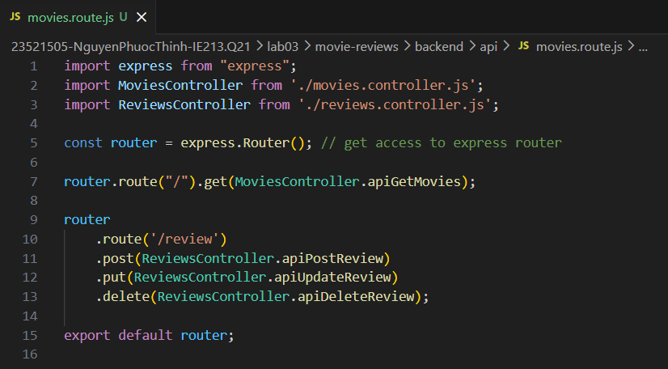


### Bài 2: Thiết lập Controller cho review.

Tạo tệp tin reviews.controller.js để quản lý các yêu cầu có liên quan đến review từ người dùng gửi lên từ máy khách bao gồm các function:<br>
apiPostReview()<br>
apiUpdateReview()<br>
apiDeleteReview()

**Kết quả**

[reviews.controller.js](./movie-reviews/backend/api/reviews.controller.js)

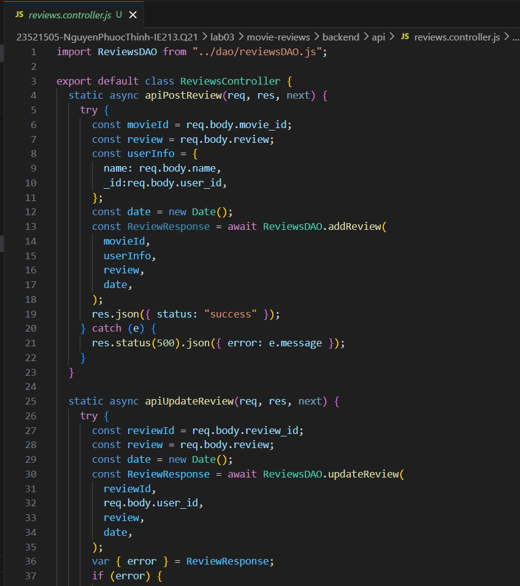


### Bài 3: Thiết lập DAO cho reviews.

#### 3.1 Trong thư mục DAO tạo tệp tin reviewsDAO.js.
DAO dùng để thao tác với database MongoDB bao gồm các function:<br>
addReview()<br>
updateReview()<br>
deleteReview()

**Kết quả**

[reviewsDAO.js](./movie-reviews/backend/dao/reviewsDAO.js)

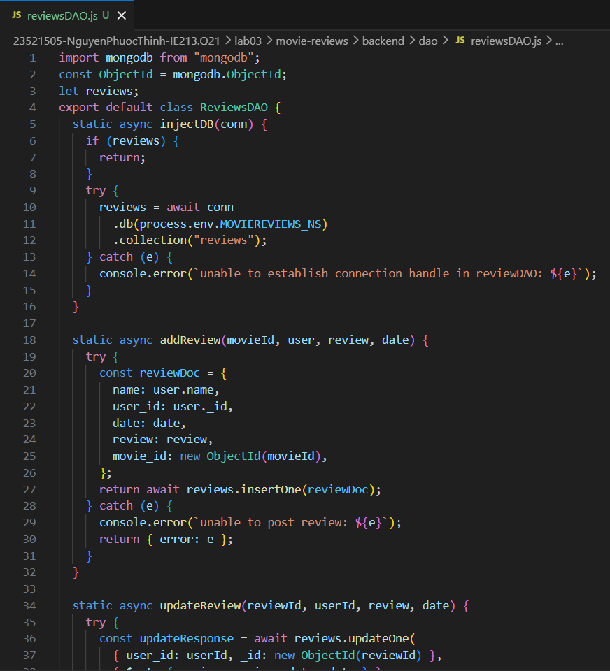

#### 3.2 Thử nghiệm các API bằng phần mềm hỗ trợ Insomnia

**Kết quả**

Thêm dữ liệu

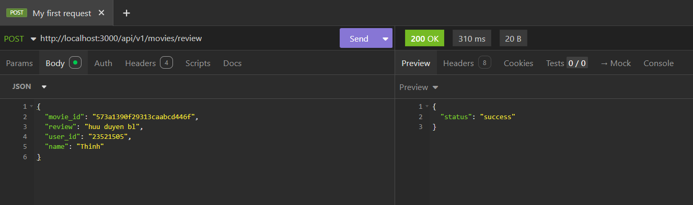

Sửa dữ liệu

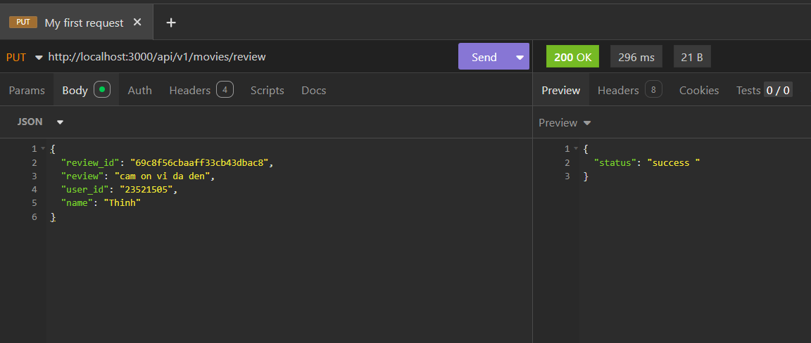

Xóa dữ liệu

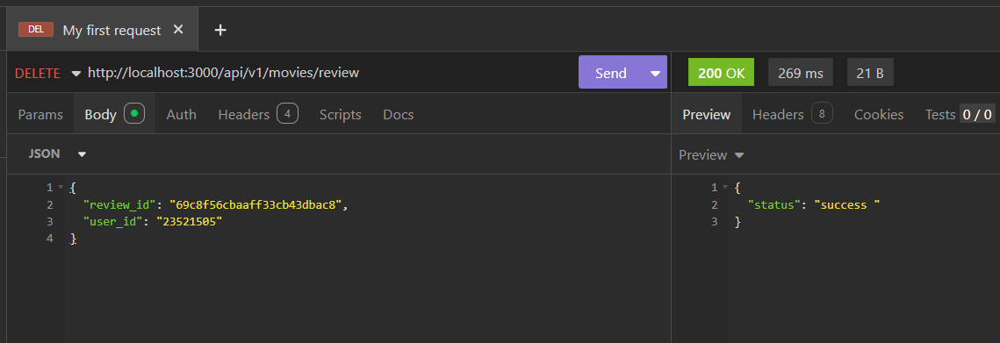


### Bài 4: Hoàn thành back-end cho ứng dụng minh họa.

#### 4.1 Thêm 2 định tuyến 

**Kết quả**

[movies.route.js](./movie-reviews/backend/api/movies.route.js)

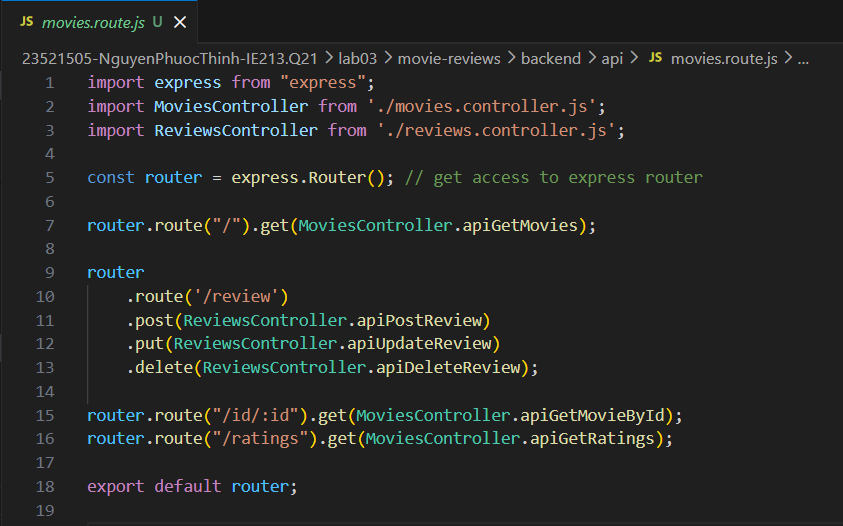

#### 4.2 Thêm 2 phương thức apiGetMovieById() và apiGetRatings() trong movie controller.

**Kết quả**

[movies.controller.js](./movie-reviews/backend/api/reviews.controller.js)

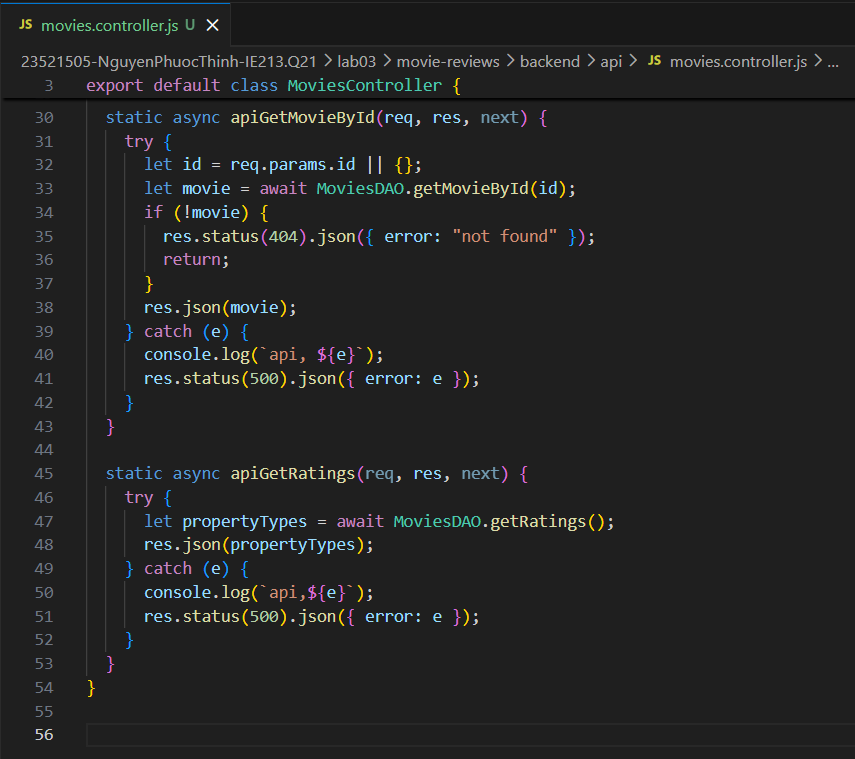


#### 4.3 Thêm 2 phương thức DAO getRatings() và getMovieById() trong dao movie.

**Kết quả**

[moviesDAO.js](./movie-reviews/backend/dao/moviesDAO.js)

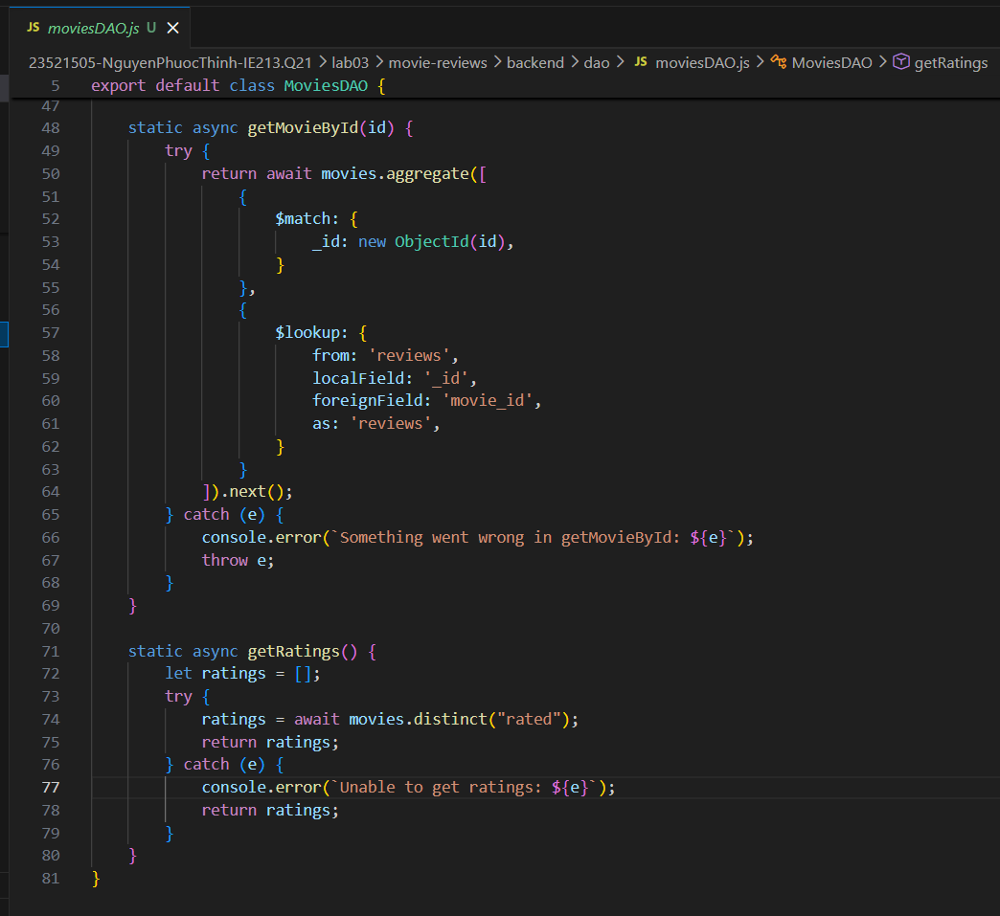

#### 4.4 Thử nghiệm các API bằng phần mềm hỗ trợ Insomnia

**Kết quả**

Lấy theo ratings 

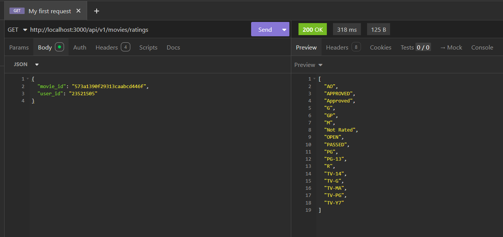

Lấy theo id 

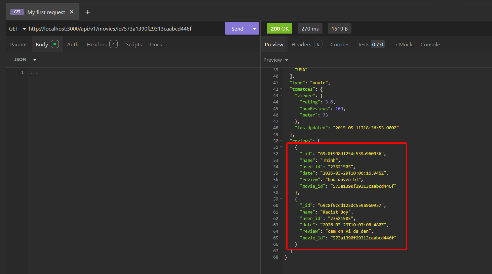
