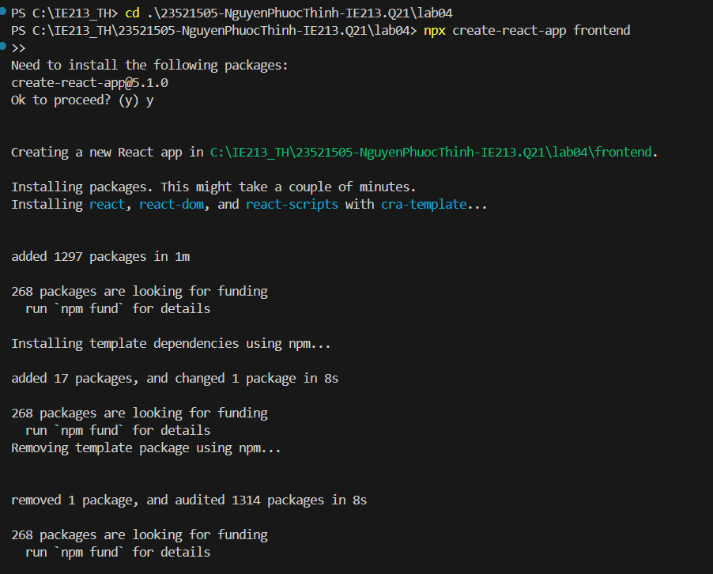
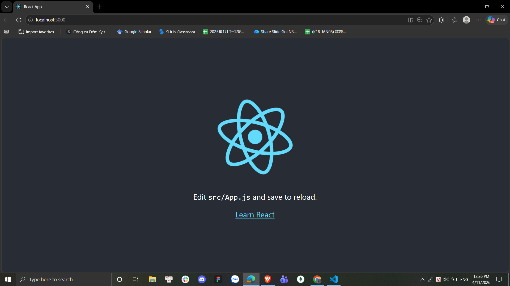
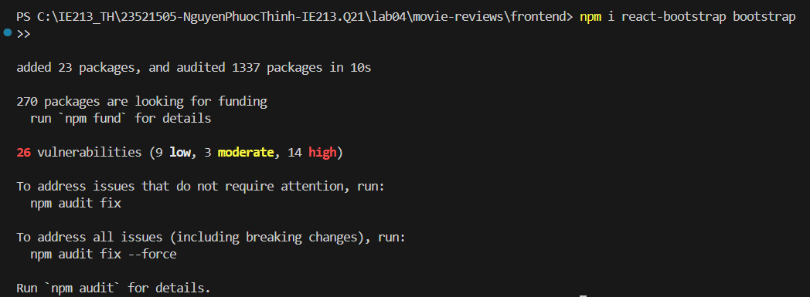
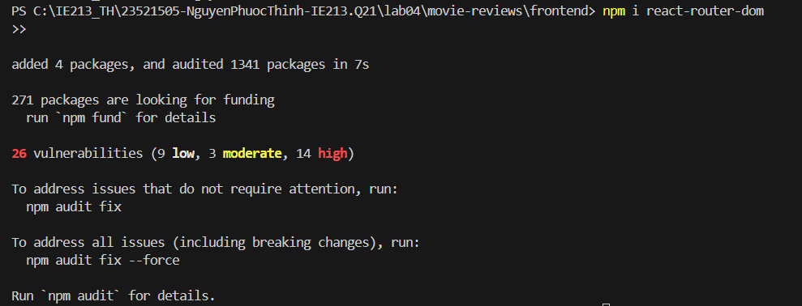
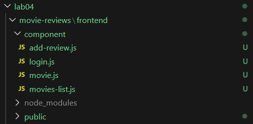
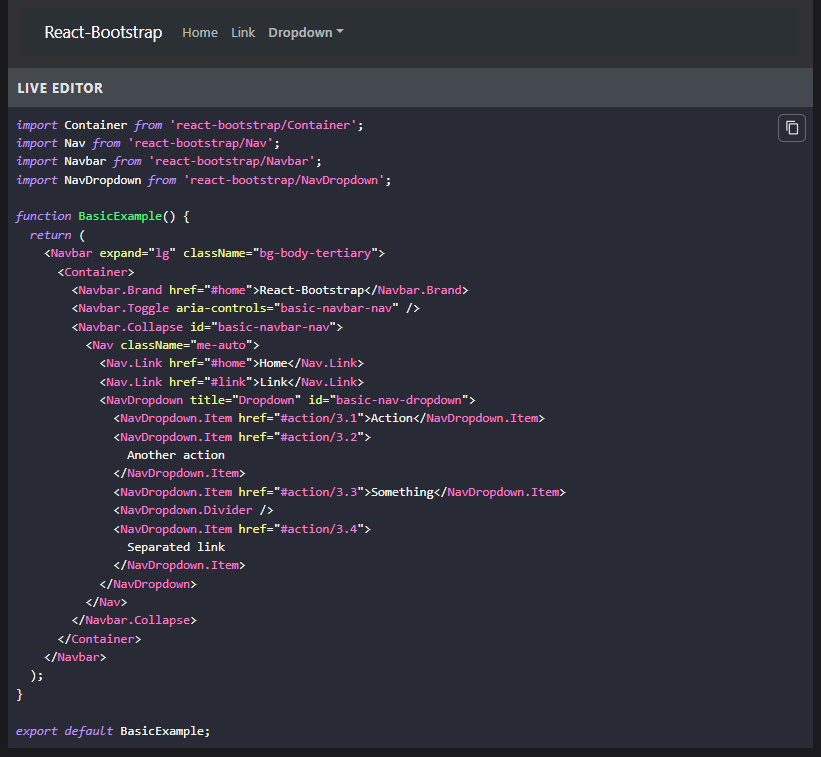
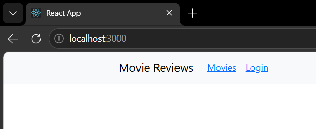
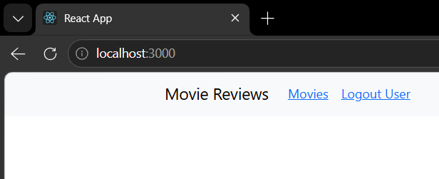
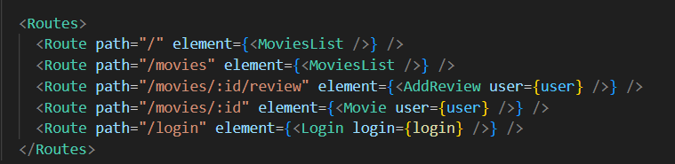

# LAB04 – Thiết lập Frontend với ReactJS

---
## Thông tin sinh viên
* Họ tên: Nguyễn Phước Thịnh
* MSSV: 23521505
* Môn học: IE213.Q21 – Kỹ thuật phát triển hệ thống Web
* Lớp: IE213.Q21.1

---
## Mục tiêu
* Hiểu được cách thiết lập frontend trong MERN stack với ReactJS
* Giới thiệu một số package chủ yếu trong việc xây dựng mã nguồn frontend
* Thực hành xây dựng thanh Navigation Header bar với sự hỗ trợ của Bootstrap
* Cách chia các component trong dự án

---
## Công cụ sử dụng
* NodeJS
* ReactJS
* Bootstrap
* React Router DOM
* React Bootstrap
* VS Code
* AI (ChatGPT, ClaudeCode)

---
## Cấu trúc thư mục bài thực hành 4
```text
lab04
├── movie-reviews/
│   └── frontend/
│       ├── public/
│       ├── src/
│       │   ├── components/
│       │   │   ├── add-review.js
│       │   │   ├── login.js
│       │   │   ├── movie.js
│       │   │   └── movies-list.js
│       │   ├── App.js
│       │   └── index.js
│       └── package.json
├── screenshots/
└── Lab04.md
```

---
## Thực hiện

### Bài 1: Thiết lập nơi làm việc với frontend của dự án

#### 1.1 Tạo template frontend với React trong thư mục Movie Review

Tạo ứng dụng React bằng lệnh:
```bash
npx create-react-app frontend
```

Chạy ứng dụng với câu lệnh:
```bash
cd frontend
npm start
```

**Kết quả**





#### 1.2 Cài đặt một số package hỗ trợ xây dựng dự án

Cài đặt Bootstrap và React Router DOM:
```bash
npm i react-bootstrap bootstrap
npm i react-router-dom
```

**Kết quả**





---

### Bài 2: Xây dựng Navigation Header bar cho ứng dụng

#### 2.1 Tạo các component cần thiết

Tạo thư mục `components` trong `src/` và tạo các file component:
- `movies-list.js`: hiển thị thông tin danh sách phim
- `movie.js`: hiển thị phim với các review
- `add-review.js`: hỗ trợ thêm review cho khách
- `login.js`: trang đăng nhập cho khách

**Kết quả**



#### 2.2 Lấy Navbar Component từ React-Bootstrap

Lấy Navbar Component từ https://react-bootstrap.github.io/docs/components/navbar/ và đưa vào trong phần mã nguồn JSX của function `App()` trong tệp tin `App.js`.

**Kết quả**



#### 2.3 Điều chỉnh thông tin Navbar

Điều chỉnh các thông tin sau:
- Tên logo: **Movie Reviews**
- Liên kết thứ nhất: thay `Home` thành `Movies`
- Liên kết thứ hai: thay `Link` thành trạng thái `Login/Logout` của người dùng

Sử dụng React hook `useState` để lưu giữ và thay đổi trạng thái đăng nhập:
```javascript
const [user, setUser] = React.useState(null);
```

**Kết quả**

Trạng thái chưa đăng nhập (hiển thị Login):



Trạng thái đã đăng nhập (hiển thị Logout User):



---

### Bài 3: Thiết lập các định tuyến cho các component

#### 3.1 Sử dụng thẻ `<Routes>` để định tuyến

Trong tệp tin `App.js` sử dụng thẻ `<Routes>` (import từ `react-router-dom`) để định tuyến cho 4 component tạo ở bài 2.1.

- `"/"` và `"/movies"`: đến component `MoviesList`
- `"/movies/:id/review"`: đến component `AddReview`
- `"/movies/:id"`: đến component `Movie`
- `"/login"`: đến component `Login`

**Kết quả**

[App.js](./movie-reviews/frontend/src/App.js)

