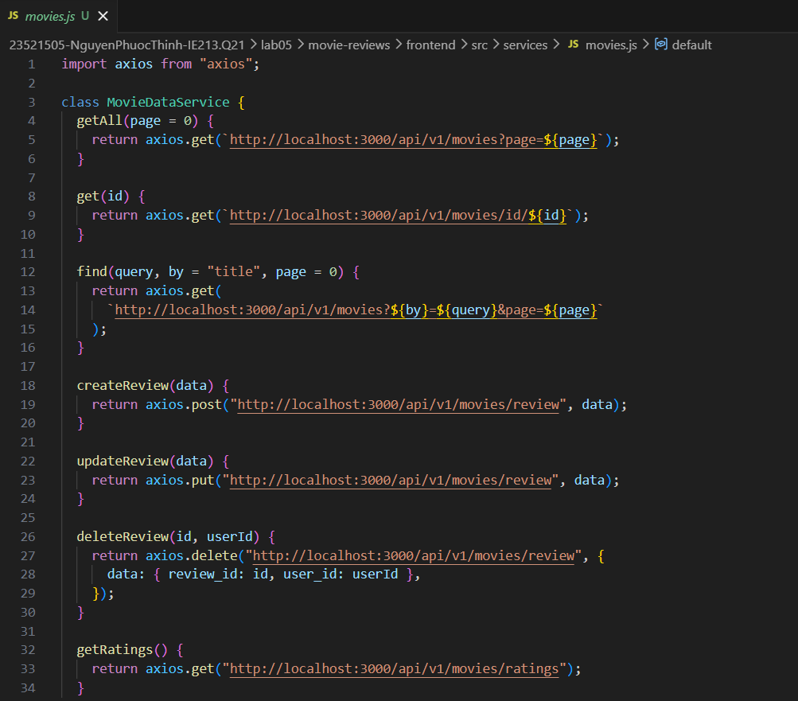
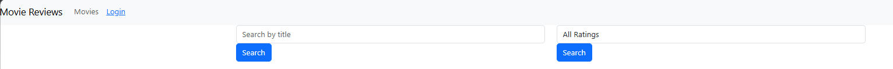
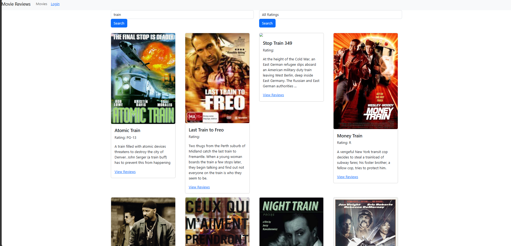
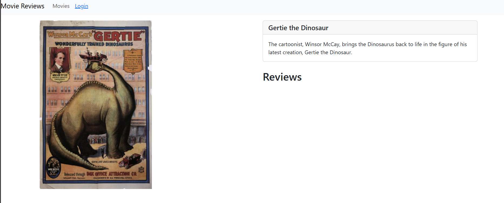
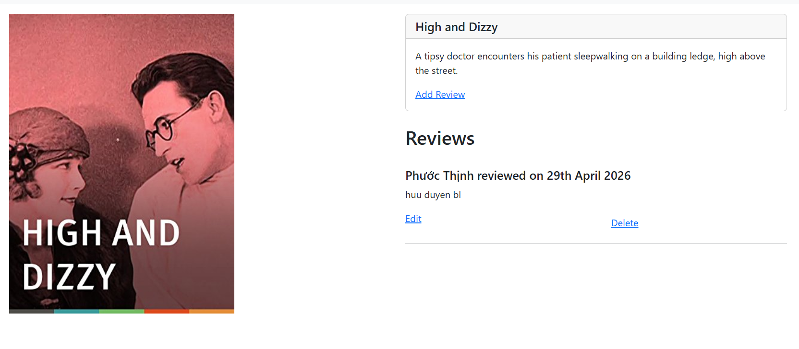
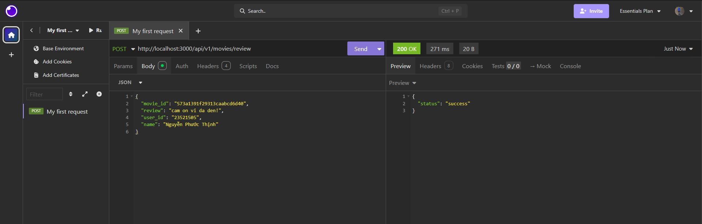
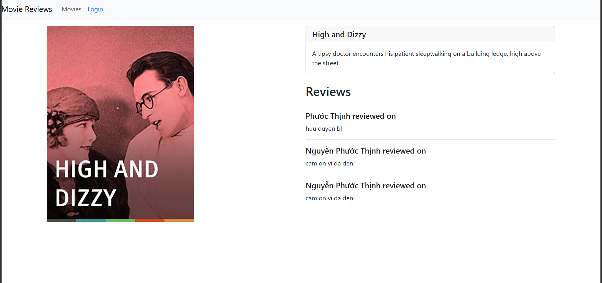
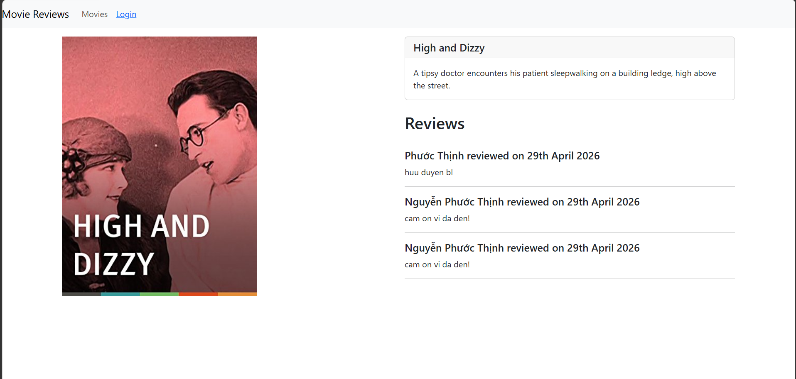

# LAB05 – Xây dựng Frontend với ReactJS

---

## Thông tin sinh viên

* Họ tên: Nguyễn Phước Thịnh
* MSSV: 23521505
* Môn học: IE213.Q21 – Kỹ thuật phát triển hệ thống Web
* Lớp: IE213.Q21.1

---

## Mục tiêu

* Hiểu được cách kết nối từ frontend tới backend với ReactJS
* Giới thiệu một số package chủ yếu trong việc xây dựng mã nguồn frontend
* Tạo các form để người dùng nhập vào tìm kiếm dữ liệu
* Hiển thị danh sách movie thông qua các component của React-Bootstrap như Card, Link, Switch, Route
* Giới thiệu các hook như `useState()` và `useEffect()` trong ReactJS
* Hiển thị một trang chi tiết về Movie (ứng dụng minh hoạ)
* Hiển thị các review có liên quan đến Movie

---

## Lưu ý quan trọng

Lab 05 là phần **tiếp nối trực tiếp** từ Lab 03 và Lab 04:

* **Backend (Lab 03)**: các API `/movies`, `/movies/id/:id`, `/movies/ratings`, `/movies/review` phải đang chạy ở `localhost:3000` (hoặc port đã cấu hình)
* **Frontend (Lab 04)**: cấu trúc component và routing đã được thiết lập sẵn — Lab 05 sẽ điền nội dung vào các component còn rỗng

---

## Công cụ sử dụng

* NodeJS
* ReactJS
* React-Bootstrap
* React Router DOM
* Axios
* Moment.js
* VS Code
* AI (ChatGPT, ClaudeCode)
* Insomnia / Postman

---

## Cấu trúc thư mục bài thực hành 5

```text
lab05
├── movie-reviews/
│   ├── backend/
│   │   ├── api/
│   │   │   ├── movies.controller.js
│   │   │   ├── movies.route.js
│   │   │   └── reviews.controller.js
│   │   ├── dao/
│   │   │   ├── moviesDAO.js
│   │   │   └── reviewsDAO.js
│   │   ├── index.js
│   │   ├── package.json
│   │   └── server.js
│   └── frontend/
│       ├── public/
│       ├── src/
│       │   ├── components
│       │   │   ├── add-review.js
│       │   │   ├── login.js
│       │   │   ├── movie.js
│       │   │   └── movies-list.js
│       │   ├── services
│       │   │   └── movies.js
│       │   ├── App.css
│       │   ├── App.js
│       │   ├── index.css
│       │   └── index.js
│       └── package.json
├── screenshots/
└── Lab05.md
```
---

## Thực hiện

### Bài 1: Kết nối tới Backend

#### 1.1 Cài đặt axios cho dự án hiện tại

```bash
npm install axios
```

#### 1.2 Tạo lớp dịch vụ `MovieDataService`

Tạo thư mục `src/services/` và tệp tin `movies.js` chứa class `MovieDataService` dùng axios để gọi tới các API backend.

#### 1.3 Tạo các lời gọi dịch vụ tới backend

Các phương thức được triển khai trong `MovieDataService`:

* `getAll(page)` — lấy danh sách phim (có phân trang)
* `get(id)` — lấy thông tin chi tiết phim theo id
* `find(query, by, page)` — tìm kiếm phim theo title hoặc rating
* `createReview(data)` — thêm review mới
* `updateReview(data)` — cập nhật review
* `deleteReview(id, userId)` — xoá review
* `getRatings()` — lấy danh sách các loại rating

Mỗi phương thức tương ứng với một endpoint đã xây dựng ở backend (Lab 03).

**Kết quả**

[movies.js](./movie-reviews/frontend/src/services/movies.js)



---

### Bài 2: Xây dựng MoviesList Component

#### 2.1 Tạo các biến trạng thái

Sử dụng `useState()` để khai báo các state: `movies`, `searchTitle`, `searchRating`, `ratings`.

#### 2.2 Tạo phương thức `retrieveMovies()` và `retrieveRatings()`

* `retrieveMovies()`: gọi `MovieDataService.getAll()` và lưu kết quả vào state `movies`
* `retrieveRatings()`: gọi `MovieDataService.getRatings()` và lưu kết quả vào state `ratings`, thêm option `"All Ratings"` ở đầu danh sách
* Dùng `useEffect()` để gọi cả hai phương thức sau khi component render lần đầu

#### 2.3 Tạo 2 search form

* Form tìm theo title: `<Form.Control type="text">` với handler `onChangeSearchTitle`
* Form tìm theo rating: `<Form.Control as="select">` render các option từ mảng `ratings`, với handler `onChangeSearchRating`

**Kết quả**



#### 2.4 Hiển thị danh sách phim bằng `<Card>` của React-Bootstrap

Dùng `.map()` để render từng phim thành một `<Card>` gồm: ảnh poster, tên phim, rating, tóm tắt nội dung, và link "View Reviews".

#### 2.5 Hiện thực phương thức `findByTitle()` và `findByRating()`

* `findByTitle()`: gọi `find(searchTitle, "title")`
* `findByRating()`: nếu chọn `"All Ratings"` thì gọi `retrieveMovies()`, ngược lại gọi `find(searchRating, "rated")`

**Kết quả**



---

### Bài 3: Hiển thị thông tin trang Movie khi nhấn vào "View Reviews"

#### 3.1 Thiết lập state cho component Movie

Khai báo state `movie` với các trường: `id`, `title`, `rated`, `reviews`.

#### 3.2 Xây dựng phương thức `getMovie()`

Gọi `MovieDataService.get(id)` và cập nhật state `movie` với dữ liệu trả về.
Dùng `useEffect()` để gọi `getMovie()` khi `props.match.params.id` thay đổi.

#### 3.3 Trang trí phần JSX

Hiển thị layout 2 cột gồm:
* Cột trái: ảnh poster phim
* Cột phải: tên phim, nội dung tóm tắt (plot), link "Add Review" (chỉ hiện nếu user đã đăng nhập), tiêu đề "Reviews"

**Kết quả**



---

### Bài 4: Hiển thị danh sách Review dưới phần Plot

#### 4.1 Viết JSX hiển thị danh sách review

Dùng `movie.reviews.map()` để render từng review gồm: tên người review,
ngày review, nội dung review. Nếu user đang đăng nhập và là tác giả,
hiển thị thêm nút "Edit" và "Delete".

**Kết quả**

[movie.js](./movie-reviews/frontend/src/components/movie.js)



#### 4.2 Thêm review mẫu qua Insomnia

Tiến hành thêm một số review thông qua Insomnia để kiểm thử giao diện:





#### 4.3 Định dạng thời gian với Moment.js

Cài đặt moment.js:

```bash
npm install moment
```

Sử dụng trong JSX:

```jsx
{moment(review.date).format("Do MMMM YYYY")}
```

**Kết quả**

