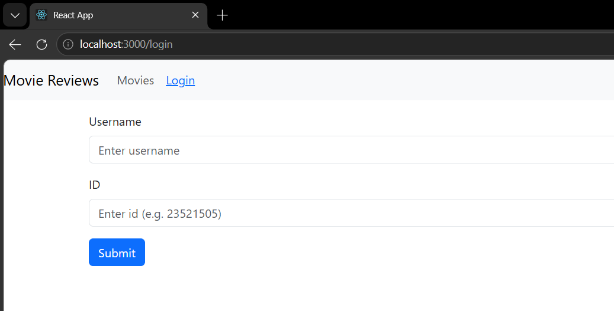
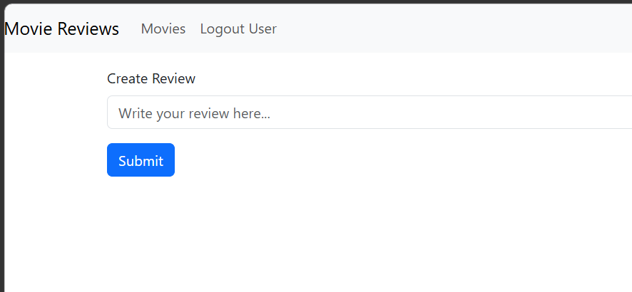
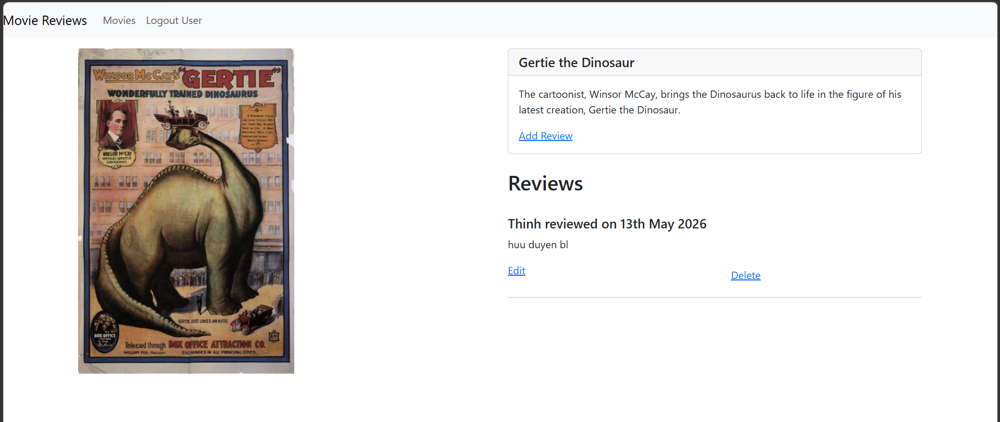
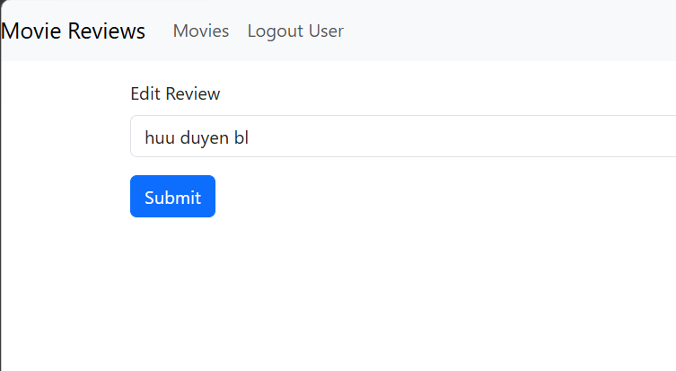
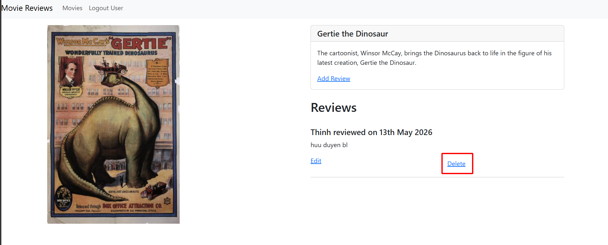
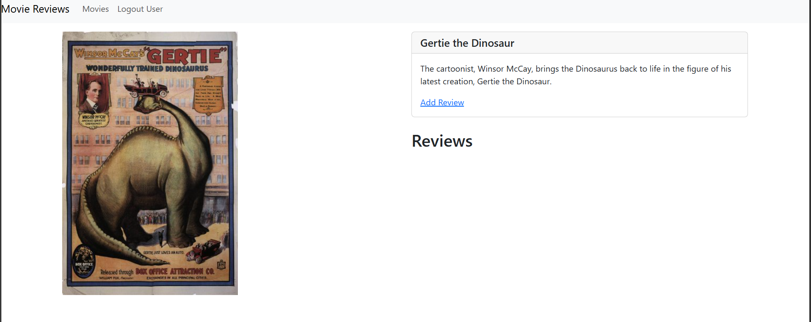
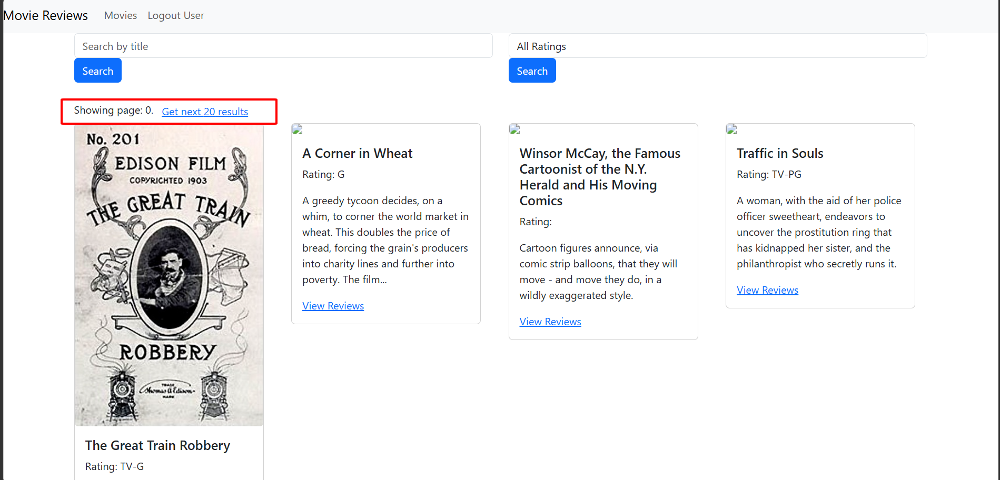
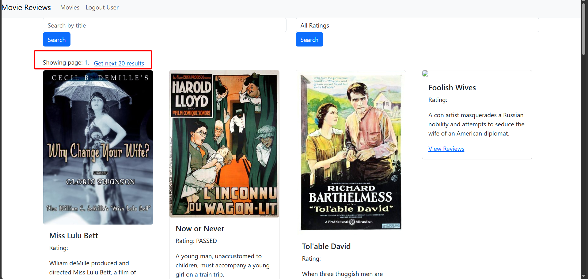
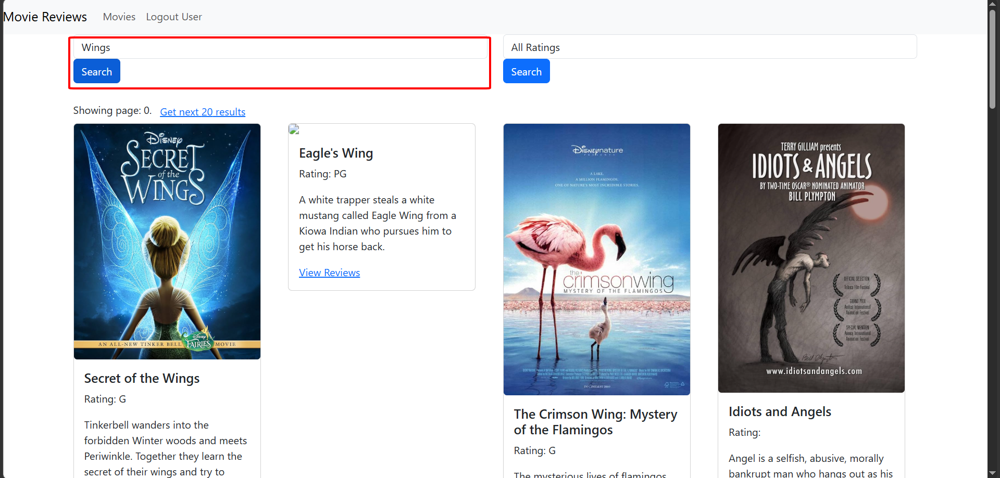
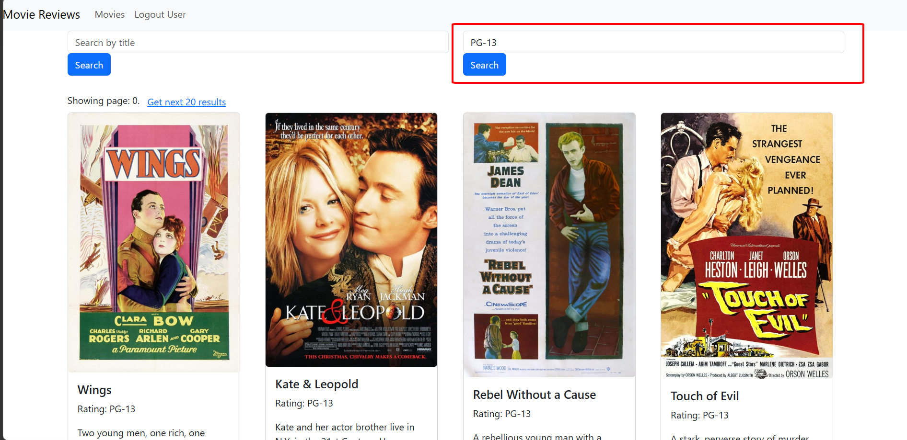

# LAB06 – Xây dựng Frontend với ReactJS (tt)

---

## Thông tin sinh viên

* Họ tên: Nguyễn Phước Thịnh
* MSSV: 23521505
* Môn học: IE213.Q21 – Kỹ thuật phát triển hệ thống Web
* Lớp: IE213.Q21.1

---

## Mục tiêu

* Hiểu cách MERN stack hoạt động thông qua các sự kiện thêm/xoá/sửa review từ frontend
* Lấy dữ liệu movie theo từng trang và theo các tiêu chí tìm kiếm như Title, Rating

---

## Lưu ý quan trọng

Lab 06 là phần **tiếp nối trực tiếp** từ Lab 03, Lab 04 và Lab 05:

* **Backend (Lab 03)**: các API `/movies`, `/movies/id/:id`, `/movies/ratings`, `/movies/review` phải đang chạy ở `localhost:3000` (hoặc port cấu hình ở file env)
* **Frontend (Lab 06)**: `localhost:3001`
---

## Công cụ sử dụng

* NodeJS, ReactJS, React-Bootstrap, React Router DOM
* Axios, Moment.js
* VS Code
* AI (ChatGPT, ClaudeCode)

---

## Cấu trúc thư mục

```text
lab06
├── movie-reviews/
│   ├── backend/
│   │   ├── api/
│   │   │   ├── movies.controller.js
│   │   │   ├── movies.route.js
│   │   │   └── reviews.controller.js
│   │   ├── dao/
│   │   │   ├── moviesDAO.js
│   │   │   └── reviewsDAO.js
│   │   ├── index.js
│   │   ├── package.json
│   │   └── server.js
│   └── frontend/
│       ├── public/
│       ├── src/
│       │   ├── components
│       │   │   ├── add-review.js
│       │   │   ├── login.js
│       │   │   ├── movie.js
│       │   │   └── movies-list.js
│       │   ├── services
│       │   │   └── movies.js
│       │   ├── App.css
│       │   ├── App.js
│       │   ├── index.css
│       │   └── index.js
│       └── package.json
├── screenshots/
└── Lab06.md
```

---

## Thực hiện

### Bài 1: Thêm và Sửa Review

#### 1.1 Tạo Login Component

Khi đăng nhập thành công, user thấy được nút **Edit** và **Delete** của review do chính họ tạo.
Sau khi login, redirect về trang Home bằng `useNavigate()`.

**Kết quả**

[login.js](./movie-reviews/frontend/src/components/login.js)



#### 1.2 Thêm review

Trong `add-review.js` tạo các biến và hàm:

* `editing` — `true` nếu đang ở chế độ sửa, `false` nếu đang thêm mới
* `initialReviewState` — chuỗi rỗng khi thêm mới, hoặc nội dung review cũ khi sửa
* `review` — state lưu nội dung review người dùng nhập
* `submitted` — state theo dấu nếu review đã được gửi thành công
* `onChangeReview()` — theo vết khi người dùng thay đổi nội dung textarea
* `saveReview()` — gọi `createReview()` hoặc `updateReview()` trong `MovieDataService`

`movie_id` được lấy trực tiếp từ URL qua `useParams()`.

**Kết quả**

[add-review.js](./movie-reviews/frontend/src/components/add-review.js)



#### 1.3 Sửa review

Khi user nhấn nút **Edit** trên trang phim, navigate đến `add-review` với `state: { currentReview: review }`.
Trong `add-review.js`, kiểm tra `location.state.currentReview`:
* Nếu có → `editing = true`, `initialReviewState = currentReview.review`
* Nếu `editing` là `true` → gọi `updateReview()` thay vì `createReview()`

**Kết quả**




---

### Bài 2: Xoá Review

Trong `movie.js`, nút **Delete** gọi `deleteReview(review._id, index)`:

* Gọi `MovieDataService.deleteReview(reviewId, props.user.id)`
* Trong callback `.then()`: lấy mảng `reviews` hiện tại, dùng `splice(index, 1)` để xoá phần tử tại vị trí `index`
* Cập nhật lại state `movie` với mảng reviews mới

Chỉ user đã tạo review (so sánh `props.user.id === review.user_id`) mới thấy nút Delete.

**Kết quả**

[movie.js](./movie-reviews/frontend/src/components/movie.js)




---

### Bài 3: Lấy dữ liệu cho trang tiếp theo

#### 3.1 getAll() với phân trang

Trong `movies-list.js` thêm:

* State `currentPage` (khởi tạo `0`) và `entriesPerPage` (khởi tạo `0`)
* Trong `retrieveMovies()`: truyền `currentPage` vào `MovieDataService.getAll(currentPage)`, lưu `response.data.page` và `response.data.entries_per_page` vào state
* Thêm `useEffect` theo dõi `currentPage`: khi thay đổi thì gọi `retrieveNextPage()`
* Trong JSX thêm hiển thị trang hiện tại và nút **"Get next N results"**

**Kết quả**





#### 3.2 find() với phân trang và search mode

Thêm state `currentSearchMode` nhận 2 giá trị `"findByTitle"` hoặc `"findByRating"`:

* `useEffect` theo dõi `currentSearchMode`: khi thay đổi thì `setCurrentPage(0)` về 0
* `retrieveNextPage()`: dựa vào `currentSearchMode` để gọi `findByTitle()`, `findByRating()` hoặc `retrieveMovies()`
* Truyền `currentPage` vào `MovieDataService.find()`
* Các hàm `retrieveMovies()`, `findByTitle()`, `findByRating()` đều gọi `setCurrentSearchMode()` tương ứng

**Kết quả**



